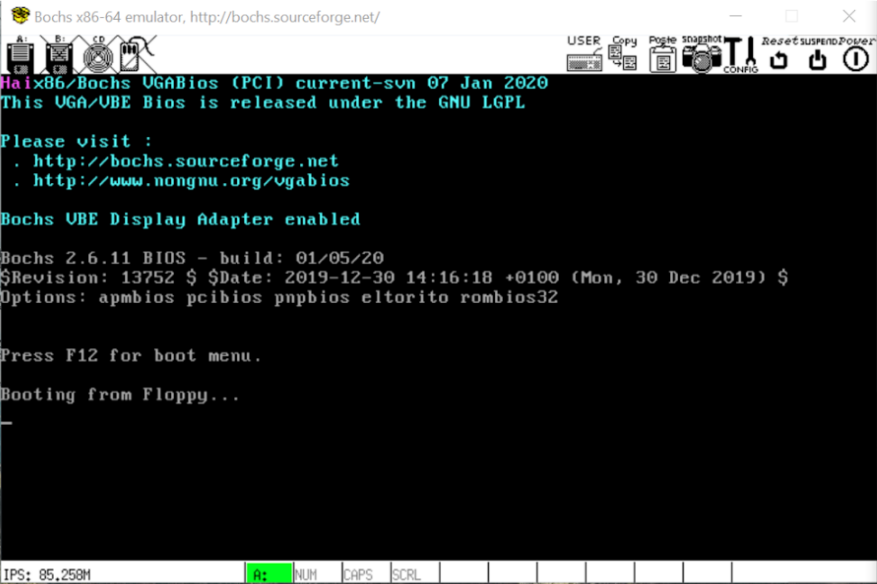
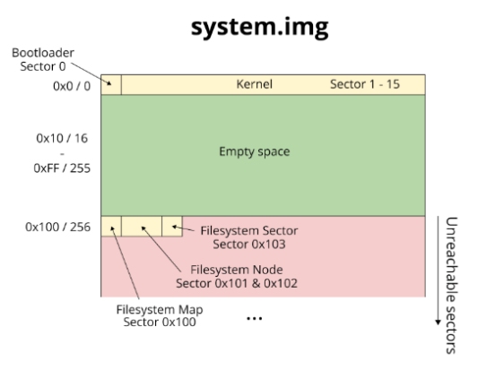
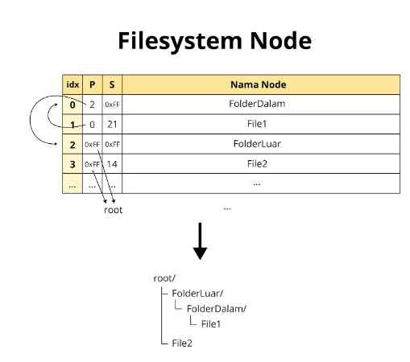
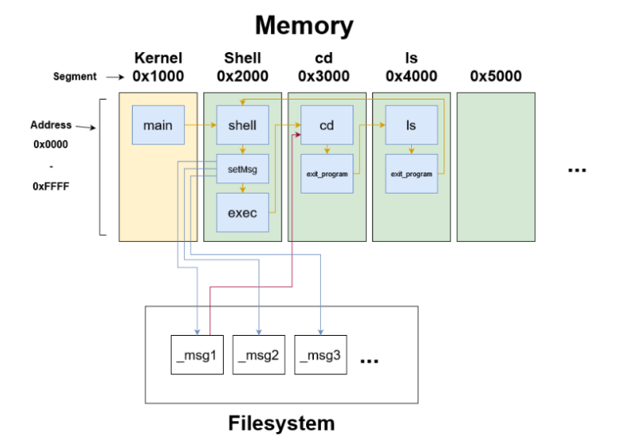

# 16-bit Operating System
> This repository contains 16-bit operating system project, developed using C + Assembly and simulated using Bochs

## Related Documents
The specification related to this project can be accessed via these links
- [Milestone 1](https://docs.google.com/document/d/1x9g3kspefka_vBl8JseBROv8f7cQdfEq-59W0jOqmo4/edit)
- [Milestone 2](https://docs.google.com/document/d/12b8gwm5RZyFfdXUKDzauFuJMtFQ2QCcKEqiJBa7sORU/edit)
- [Milestone 3](https://docs.google.com/document/d/1-ofSIjvQA089TuUklTesTLeBeCW_4HJiJOdDCAicop8/edit)
- Or [docs directory](./docs)

## Functionalities
1. Read input from keyboard and write output to the screen
2. Basic file system commands: `cd`, `ls`, `mkdir`, `cat`, `cp`, `mv`
3. Process creation (outside kernel process)
4. Message passing from multiple program (using shared file)
5. Running multiple process sequentially

## Implemented Syscalls
- Screen Related
  - Read Input
  - Print Input
  - Clear Screen
- File System Related
  - Read Sector
  - Write Sector
  - Read File
  - Write File
- Process Related
  - Execute Program
  - Passing Message

## How to run
- This project is developed using Ubuntu 20.04 OS. We suggest to use the same OS
- Use Make file to run the OS
  ```
  make build-run
  ```
- Use Make file as well to test the OS
  ```
  make test
  ``` 

## Images
### Fresh Bootup OS


### File System Image Illustration


### File System Node Illustration


### Message Passing Mechanism Illustration

